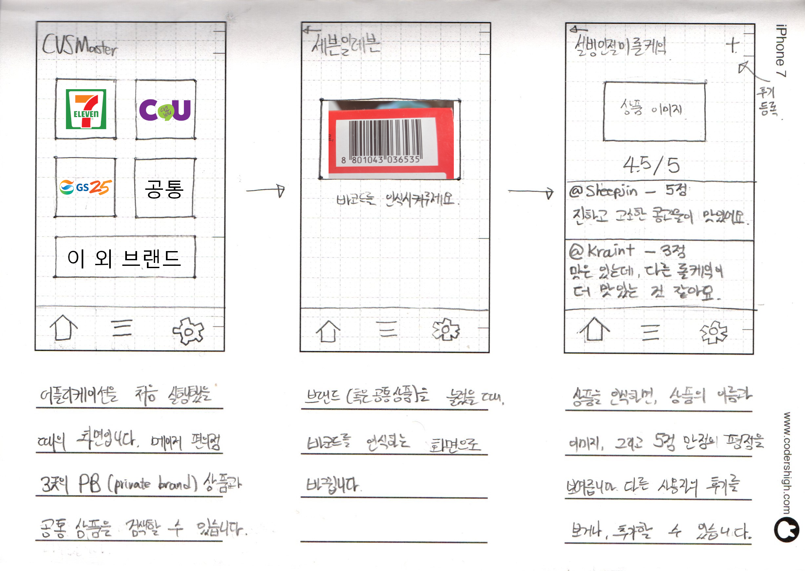
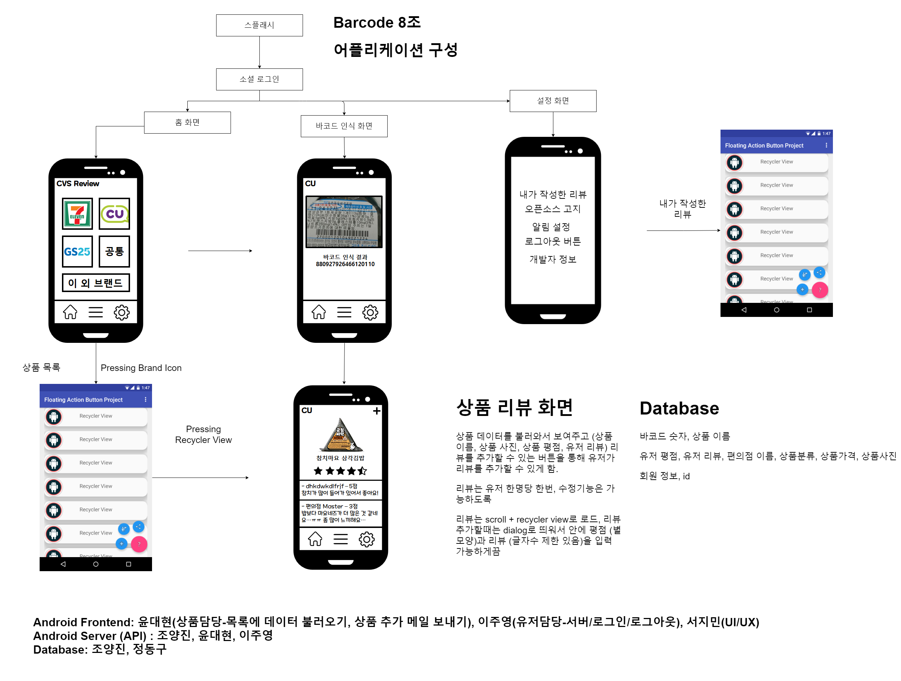
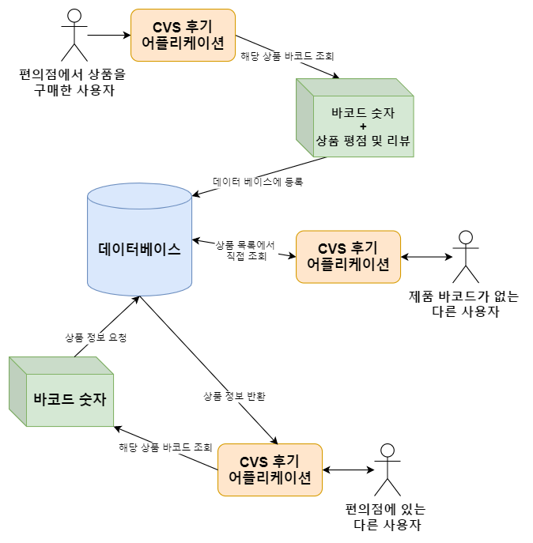

# CVS Review Application

## TODO List

#### Android

- 바코드 인식 (Google Mobile Vision API)
- 사용자 계정 만들기
- 사용자 계정 로그인 / 로그아웃
- UI / UX 디자인

#### Database

- 데이터베이스 구조화
- 특정 유저가 작성한 리뷰 목록 조회 기능
- 상품을 최고 평점순, 최하 평점순, 리뷰 많은 순으로 정렬

#### Abusing 방지 알고리즘 연구

- 유저가 작성한 모든 리뷰 목록과 평점을 조회 할 수 있게 하여 신뢰도 판단
- 바코드 사진을 직접 찍고 리뷰를 남긴 사람의 리뷰에는 뱃지 부여
- 상품 리뷰의 욕설 필터링 
